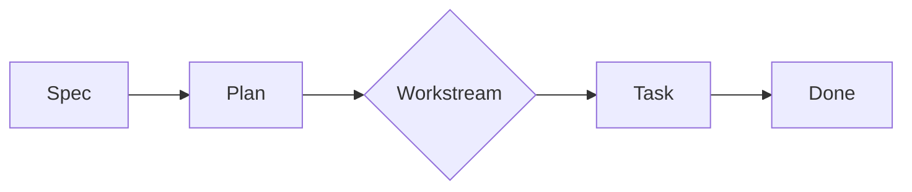

# Viewer Markdown Compatibility Samples

Reference document for verifying the Delano viewer's markdown renderer against the constructs delivery contracts use most often. Each section exercises one or more constructs from T-007 acceptance criteria.

## Headings

### Level 3 heading

#### Level 4 heading

##### Level 5 heading

###### Level 6 heading

## Paragraphs and inline formatting

This is a paragraph with **bold**, *italic*, `inline code`, a [[wikilink-target]], and an [external link](https://example.com). External links open in a new tab and carry `noreferrer noopener` for safety.

## Checklists

- [ ] Unchecked task with plain text.
- [x] Checked task with **bold** content.
- [ ] Task that includes `inline code` and a [link](https://example.com).
- [x] Another completed item.

## Nested lists

- Top level item
  - Nested item
    - Deeply nested item
- Second top level
  1. Nested ordered child
  2. Second nested ordered child
- Third top level

## Ordered list

1. First step
2. Second step
3. Third step

## Tables

| Field | Type | Notes |
| --- | --- | --- |
| id | string | Required, format `T-###` |
| status | enum | One of `ready`, `in-progress`, `done` |
| owner | string | GitHub handle or display name |

| Aligned left | Aligned center | Aligned right |
| :--- | :---: | ---: |
| left text | center text | 1 |
| longer left | mid | 1234 |

## Code fences

```javascript
function greet(name) {
  return `Hello, ${name}`;
}
```

```bash
npm run viewer
```

```
plain code without a language label
```

## Mermaid diagram (source-view fallback)



## Blockquote

> Read-only viewer for `.project` markdown contracts. Useful for reviewing delivery state without leaving the editor.

## Horizontal rule

---

End of samples.
