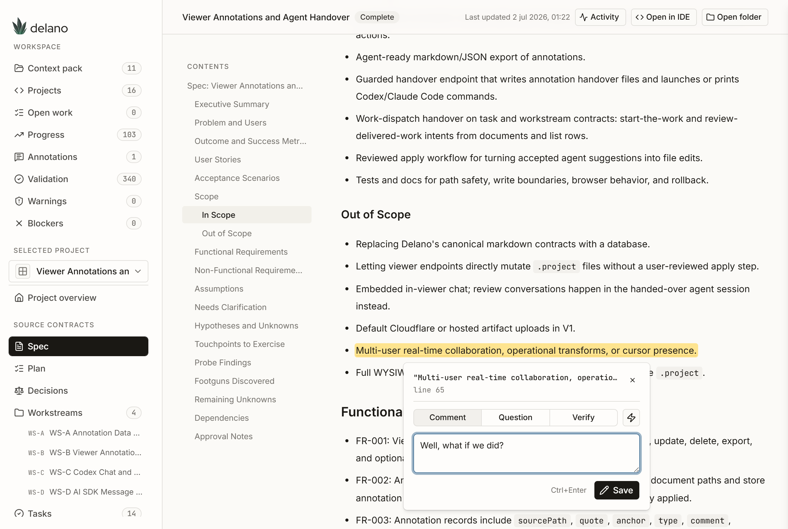
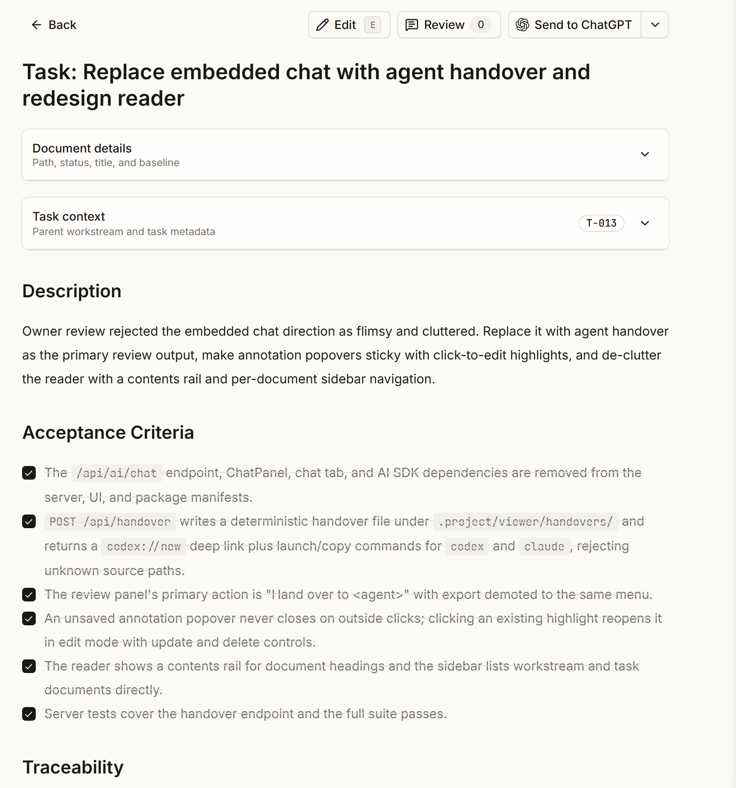
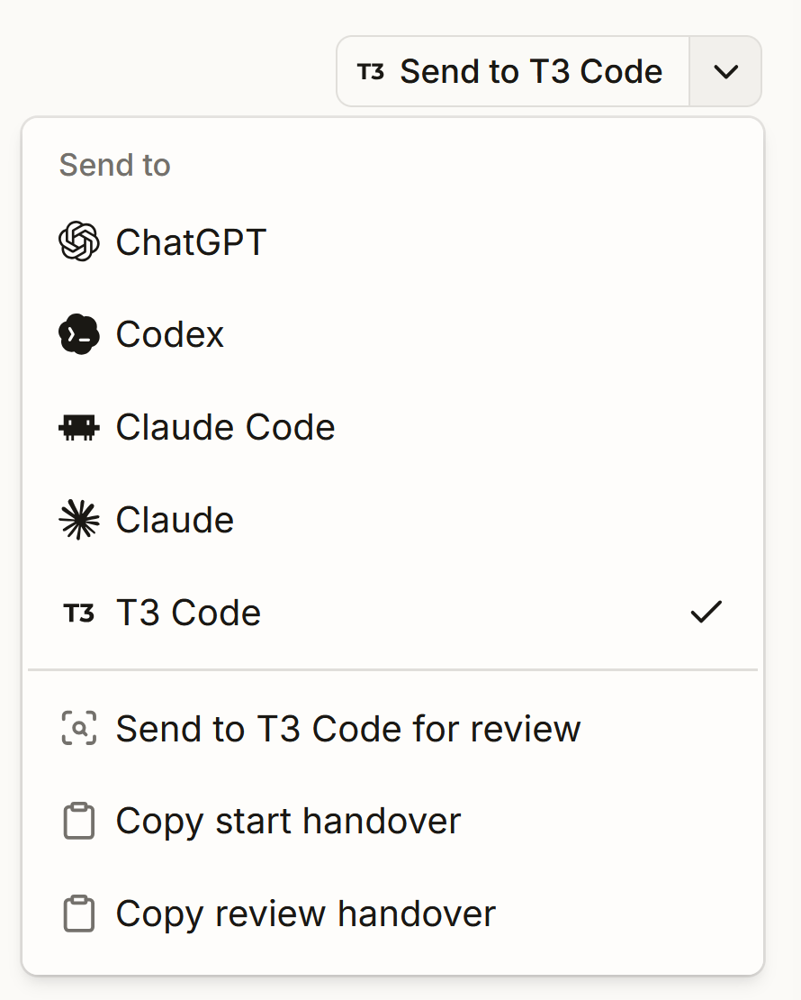

<p align="center">
  
</p>

<p align="center">
  <strong>Your agent says it's done. Prove it.</strong>
</p>

<p align="center">
  <a href="#quick-start">Install</a>
  &middot;
  <a href="#the-cli">CLI</a>
  &middot;
  <a href="#the-viewer">Viewer</a>
  &middot;
  <a href="HANDBOOK.md">Handbook</a>
  &middot;
  <a href="docs/README.md">Docs</a>
</p>

Delano is a delivery runtime for coding agents. Specs, plans, tasks, and evidence live as files in your repo. Any agent can execute them. Anyone can verify them.

Works with ChatGPT, Codex, Claude Code, Claude, and whatever ships next. No account. No cloud. No lock-in.

<p align="center">
  
</p>

## Why Delano

Coding agents produce working code in minutes. Then the session ends, and everything that made the work trustworthy disappears with it. The plan lived in a prompt. The decisions lived in scrollback. The proof that tests passed lived in the agent's memory, which is to say: nowhere.

The hard part was never getting an agent to write code. It's knowing what was agreed, what was built, and what was verified, three weeks later, by someone who wasn't in the chat.

| Before | After |
| --- | --- |
| Plans and decisions live in chat sessions that expire | Specs, plans, tasks, and decisions are files in `.project/` |
| Every agent session starts without context | Any agent reads the same contracts and continues the work |
| "Done" is a claim, not a checked state | Tasks close only with acceptance criteria met and evidence recorded |
| Switching agents means starting over | `delano validate` fails loudly when contracts and reality drift |

## How it works: contracts over tools

Delano's core idea fits in one sentence: files define truth, tools execute against files. Every project follows the same flow, and each step is a markdown file in your repo. You can read it, diff it, review it, and version it like everything else you ship.

```text
Outcome → Spec → Probe decision → Plan → Workstreams → Tasks → Evidence → Learnings
```

Two details matter here.

**The probe decision.** Before a spec gets approved, Delano forces one explicit choice: is this approach proven, or does it need a small prototype first? Skipping the probe is allowed. Skipping it silently is not. The decision goes on record either way.

**Evidence.** An agent claiming a task is done counts for nothing. Done means the acceptance criteria are checked and the evidence log shows what ran, what passed, and where the proof lives. An agent that closes a task without evidence fails the gate.

<p align="center">
  
</p>

## Rules and evidence

Most process documents pretend every rule is enforced. Delano tags each one:

- `[enforced]` means a validator checks it. Violations fail `delano validate`.
- `[policy]` means the handbook requires it and humans verify it, until a validator exists.
- `[guidance]` means recommended, deviate freely.

That honesty is the point. You always know which guarantees are mechanical and which depend on discipline. Every `[policy]` rule is an open candidate for enforcement, and the list shrinks over time.

## Skills

Delano ships ten skills that cover the delivery lifecycle: discovery, research, prototype, planning, breakdown, execution, quality, sync, closeout, and learning.

A skill is not a prompt trick. It's a contract: trigger context, required inputs, output schema, quality checks, failure behavior, and allowed side effects. The result: a Claude Code session and a Codex session decompose work the same way, because they follow the same file, not the same vibes.

## The viewer

`delano viewer` opens a local, guarded review surface at `127.0.0.1`. It reads your `.project` files and shows specs, plans, workstreams, tasks, and their dependencies as one navigable dossier.

Select any text and annotate it: a comment, a question, a verify request. Then hand the bundle to an agent with one click. The viewer writes a handover file and opens the agent with the exact feedback, scoped to the exact contract. The same button works for dispatch: point at a task, choose start or review, and the agent gets the contract file, the acceptance criteria, and the instruction to record evidence before closing.

<p align="center">
  
</p>

The viewer never edits canonical files behind your back. Annotations live in their own store (`.project/viewer/annotations.json`), and markdown changes require a diff preview and explicit confirmation. Searchable repository/worktree controls can inspect registered local repositories and divergent linked `.project` state, while linked worktrees remain read-only. The all-status Tasks view filters with raw options from the canonical task schema. It's a reading room, not a control panel.

It defaults to `http://127.0.0.1:3977`; set `DELANO_VIEWER_PORT` or `PORT` to use another port. The viewer client is built from `.delano/viewer/ui` with the shadcn CLI and real shadcn/Radix primitives. When changing viewer UI, run `npm --prefix .delano/viewer/ui run build` before `npm run build:assets`.

## Quick start

```bash
npm install -g @bvdm/delano       # once, anywhere
delano install --yes              # inside your repo
delano viewer
```

One-shot with npx instead:

```bash
npx -y @bvdm/delano@latest --yes            # equivalent to install --yes
npx -y @bvdm/delano@latest --target <repo> --yes
```

Fifteen minutes from a plain idea to a validated project with a spec, a plan, tasks with acceptance criteria, and a gate that keeps everyone honest: start with [Delano in the First 15 Minutes](docs/first-15-minutes.md).

Recommended first step after install:

```bash
delano onboarding
```

`delano onboarding` searches upward for `AGENTS.md`, asks for explicit approval before it analyzes anything, and prints recommendations using the packaged onboarding skill rubric. It does not edit `AGENTS.md` on its own.

## The CLI

The CLI is deliberately thin. It installs the runtime, reads state, and wraps the scripts that do the real work. It never phones home.

```bash
delano validate                   # do contracts and reality still agree?
delano status --open --brief      # what's in flight
delano next                       # dependency-safe next task
delano repos                      # machine-local registered repositories
delano worktrees                  # fresh Git worktree and .project health
delano init my-feature "My Feature"
delano research my-feature open-question
delano task close my-feature T-001 --evidence "tests pass, see updates/003"
```

Everything supports `--json`, because half your users are agents parsing the output.

- Package: `@bvdm/delano`, binary: `delano`
- Commands: `onboarding`, `install`, `viewer`, `context`, `project`, `workstream`, `task`, `update`, `init`, `import-spec-kit`, `research`, `validate`, `status`, `next`

Command intent:

- `delano install` bootstraps the Delano runtime into the current repository
- `delano viewer` launches the guarded local review UI for `.project` contracts
- `delano validate` checks whether the runtime, contracts, and required assets still line up
- `delano init <slug> "<Project Name>" [owner] [lead]` scaffolds a new delivery project (kebab-case slug; `owner` defaults to `team`, `lead` to `owner`)
- `delano import-spec-kit <slug> <source-md> [--name ...] [--owner ...] [--lead ...] [--json]` creates a planned project from a supported Spec Kit-style markdown fixture (see `docs/spec-kit/import-contract.md`); imported artifacts still pass through validation, probe, and evidence gates, and the command refuses to overwrite an existing project folder
- `delano research <project-slug> <research-slug> [--title ...] [--question ...] [--json]` opens repo-native research intake under `.project/projects/<slug>/research/` before anyone mutates spec, plan, workstreams, or tasks; findings fold forward into canonical artifacts or close as no-action

The wrapper commands call the PM scripts under `.agents/scripts/pm/`, which you can also run directly (`bash .agents/scripts/pm/validate.sh`, `status.sh`, `next.sh`, `research.sh`).

## Install behavior

`delano install` is conflict-first by default:

- it computes the full install plan before writing files, and aborts if an approved target path already exists
- it reports each conflict as file, directory, or symlink
- it only overwrites approved allowlist paths when `--force` is used
- it can narrow updates with `--only`, `--exclude`, `--no-project-state`, and `--interactive` presets
- it never touches unrelated files or repo-root Git config such as `.gitignore` and `.gitattributes`

Install categories are `agent-runtime`, `codex-hooks`, `skills`, `viewer`, `project-context`, `project-templates`, `project-registry`, `project-projects`, `handbook`, and `legacy-installer`. For an update-safe refresh that preserves repo-owned project state:

```bash
delano install --only skills,project-templates --force --yes
delano install --no-project-state --force --yes
```

The base payload includes `.delano/` (the guarded viewer) and `.codex/hooks.json`, a Codex `SessionStart` hook that injects compact open-project context when Codex hooks are enabled. Existing hook configs are merged, not replaced. Codex hook activation stays manual: enable `[features] hooks = true` in `~/.codex/config.toml` (or `codex --enable hooks`), trust the repo's `.codex/` layer, and approve the hook when Codex asks. Top-level adapter entry docs (`AGENTS.md`, `CLAUDE.md`, `CODEX.md`, `OPENCODE.md`, `PI.md`) are intentionally excluded and remain opt-in.

The installable `.project/context/` pack is seeded from generic templates during packaging; replace it with your repo's reality, and start with `delano onboarding`.

## What's in the repo

| Surface | Role |
| --- | --- |
| `HANDBOOK.md` | Canonical operating model |
| `.project/` | File-backed delivery contracts: specs, plans, workstreams, tasks, decisions, updates, evidence |
| `.agents/` | Shared runtime: scripts, rules, hooks, skills, adapters |
| `.claude/` | Compatibility mirror of `.agents/`, not a second runtime |
| `.delano/` | Guarded local viewer for inspecting, annotating, and reviewing `.project` state |
| `docs/delano-brandbook.html` | Brand book for the Delano visual language |

Requirements: `node` 18 or newer, `bash`, `git`, and `python3` (or compatible `python` / `py`). The CLI does not bundle its own shell or Python runtime.

## Runtime boundaries

This package is deliberately narrow:

- npm is the distribution surface; wrapper commands stay thin
- `.project` remains repo-owned after install; `.project/projects/` and `.project/registry/` should normally be excluded from forced refreshes
- `.agents` remains the runtime surface
- remote GitHub/Linear writes stay outside the default flow; sync tooling is dry-run and repair-plan oriented unless an operator explicitly approves an apply-capable workflow
- `install-delano.sh` remains available as the legacy bridge installer

## Runtime validation

`delano validate` and `bash .agents/scripts/pm/validate.sh` run local gates for artifact schemas and scope, operating modes, status transitions, dependencies, blockers, acceptance/evidence mapping, privacy-safe output defaults, package manifest drift, sync inspection and repair planning, lease contracts and conflict zones, stream-aware next-task selection, worktree health, delivery metrics, context audit scoring, and closeout learning proposals.

For release readiness:

```bash
npm --prefix .delano/viewer/ui run build
npm run build:assets
npm run check:package-manifest
bash .agents/scripts/pm/validate.sh
npm test
```

## Optional AGENTS.md / CLAUDE.md snippet

If you want explicit Delano instructions in a repo-root `AGENTS.md` or `CLAUDE.md`, copy and paste this yourself:

```md
## Delano

This repository uses Delano.

Canonical process and contracts live in `HANDBOOK.md`.
Delivery state lives in `.project/`.
Shared runtime lives in `.agents/`.
`.claude/` is a compatibility mirror of `.agents/`, not a second runtime.

When working in this repository:
- treat `.project/` as the source of truth
- use the Delano status model and evidence discipline from `HANDBOOK.md`
- keep sync and quality gates aligned with the handbook
- use `delano init <slug> "<Project Name>" [owner] [lead]` to scaffold a new delivery project when needed
- use `delano viewer` to inspect and annotate `.project/` through the guarded local UI
```

## Design language

Delano's visual system is a local dossier: warm paper, ledger ink, hairline dividers, visible source paths, and quiet status signals. Inter for product text, JetBrains Mono for provenance and exact paths. See [DESIGN.md](DESIGN.md) and the [Delano Brand Book](docs/delano-brandbook.html).

## Local development

```bash
npm --prefix .delano/viewer/ui run build
npm run build:assets
node bin/delano.js --help
node bin/delano.js --yes --target ./tmp/cli-install-smoke
```

The marketing landing page lives under [`marketing/`](marketing/README.md).

## Publishing

Publishing is handled by the GitHub Actions workflow `.github/workflows/publish-npm.yml` using npm trusted publishing (publisher: GitHub Actions, repository `MajesteitBart/delano`, workflow `publish-npm.yml`). Push a matching version tag such as `v0.3.3`, or run the workflow manually from `main`; a `dry_run` input runs the same checks without publishing. The workflow rebuilds the payload, checks manifest drift, runs tests, verifies the version is unpublished, and publishes with OIDC provenance. `repository.url` in `package.json` must stay `https://github.com/MajesteitBart/delano` for provenance validation.

## Release notes

Since `v0.2.11`, Delano has gained first-class context-pack reading, a redesigned guarded viewer, selected-text annotations, and agent handover flows for both review feedback and work dispatch, plus tighter validation around imported task graphs, invalid task statuses, and Windows/CRLF edge cases. Read the full summary in [docs/release-notes.md](docs/release-notes.md).

Thank you for the inspiration, [Plannotator](https://github.com/backnotprop/plannotator).

## Read next

- [`docs/README.md`](docs/README.md) for the user documentation index
- [`docs/user-guide.md`](docs/user-guide.md) for the practical user flow
- [`docs/cli-reference.md`](docs/cli-reference.md) for the CLI command reference
- [`docs/viewer-guide.md`](docs/viewer-guide.md) for the guarded viewer workflow
- [`docs/agent-operator-guide.md`](docs/agent-operator-guide.md) for instructing agents
- [`docs/spec-kit-and-research.md`](docs/spec-kit-and-research.md) for Spec Kit-style import and research intake
- [`HANDBOOK.md`](HANDBOOK.md) for the full operating model
- [`.agents/scripts/README.md`](.agents/scripts/README.md) for the runtime script inventory
- [`AGENTS.md`](AGENTS.md) for adapter-neutral instructions

Delano is open source, local-first, and agent-agnostic. The files are yours. The truth is in them.
